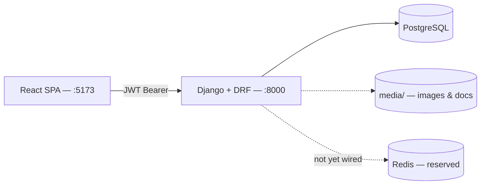
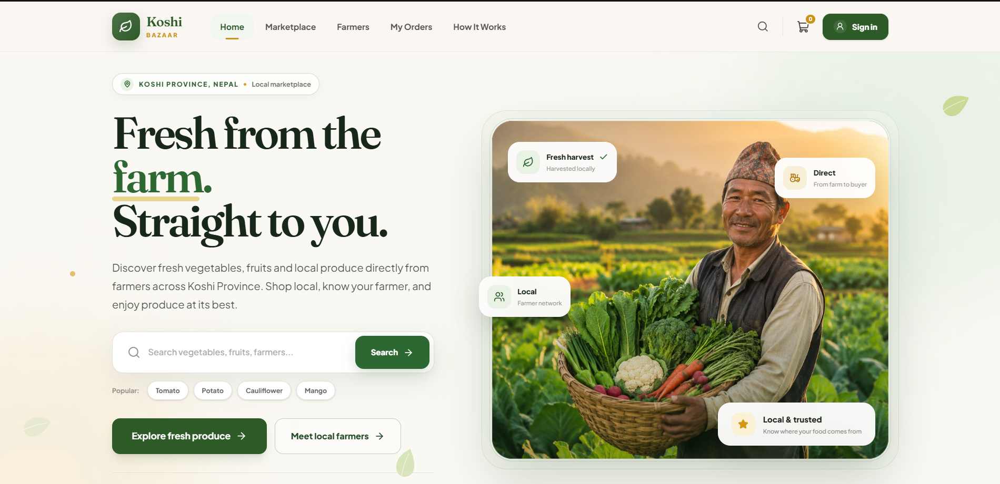
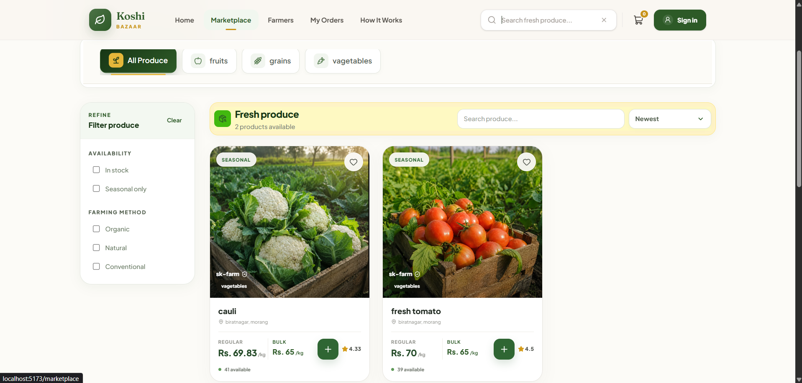
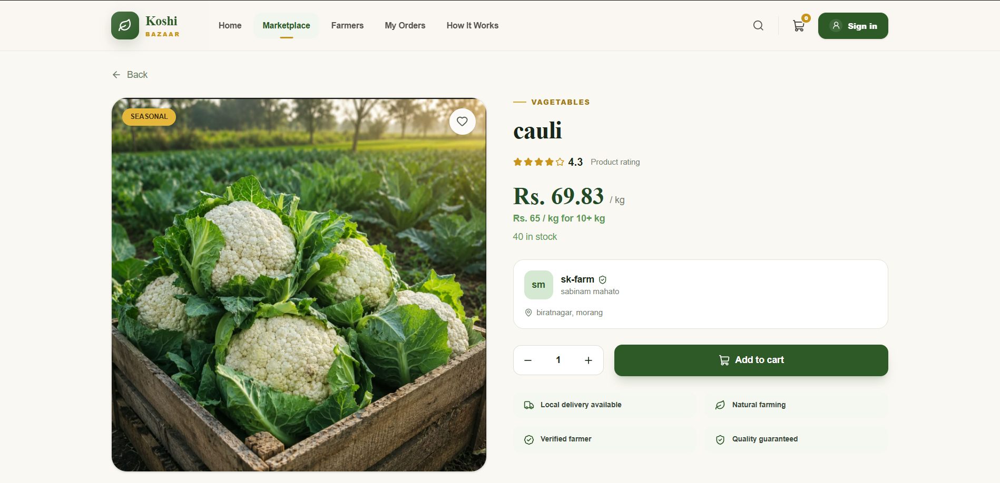
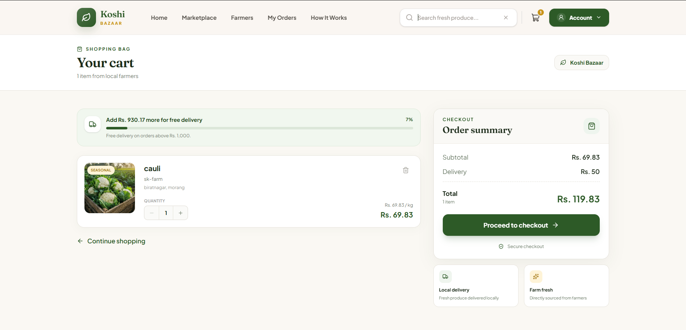
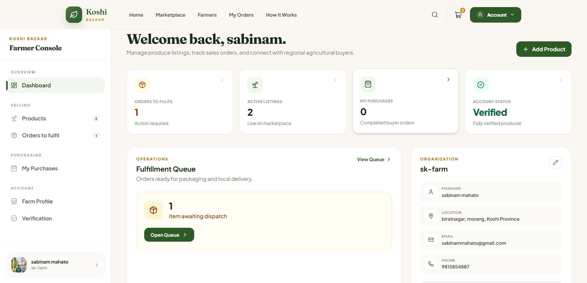
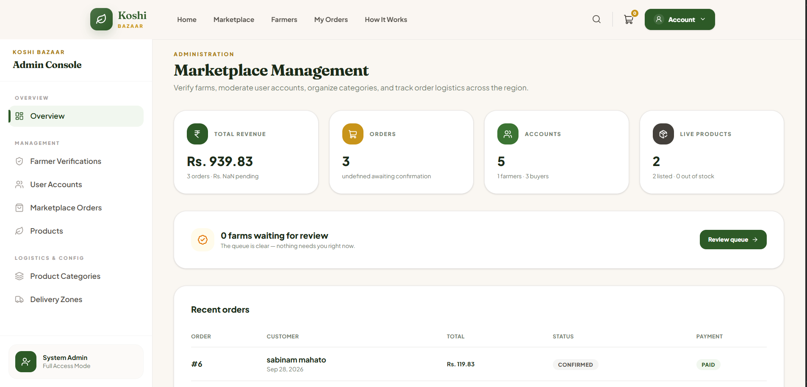

# 🌾 Koshi Bazar

**A hyperlocal farm-to-table marketplace for Koshi Province, Nepal.**

> From Koshi's farms to your kitchen — buy fresh, local produce directly from the farmers who grow it.

Koshi Bazar connects admin-verified farmers in Biratnagar, Itahari, and Damak directly with buyers, cutting out the middlemen who depress farm-gate prices and make produce hard to trace. Only a farm an administrator has approved can list products, so every item a buyer sees comes from a real, accountable farm.

B.Sc. CSIT semester project — Birat Multiple College, Biratnagar (Tribhuvan University).

---

## Table of Contents

- [Features](#features)
- [Tech Stack](#tech-stack)
- [Architecture](#architecture)
- [Screenshots](#screenshots)
- [Getting Started](#getting-started)
- [Project Structure](#project-structure)
- [Evolution — What's Not Yet Implemented](#evolution--whats-not-yet-implemented)
- [Contributor](#contributor)

---

## Features

**Buyer** — browse and filter produce, a cart that survives login, checkout with cash on delivery or a Khalti-style payment, delivery-zone pricing, order tracking.

**Farmer** — apply for verification, manage a product catalogue once approved, a fulfilment queue limited to their own order lines.

**Admin** — revenue and verification overview, approve/reject farmers, manage users, categories, delivery zones, and orders end to end.

---

## Tech Stack

| Layer | Technology |
|---|---|
| Frontend | React 19, Vite, TypeScript, Tailwind CSS v4 |
| Backend | Django 5.2, Django REST Framework |
| Auth | JWT (djangorestframework-simplejwt) |
| Database | PostgreSQL 16 |
| Cache (reserved) | Redis 7 — provisioned, not yet used |
| Containers | Docker + docker-compose |

---

## Architecture



Three roles — **Buyer**, **Farmer**, **Admin** — share one codebase but see different experiences, enforced by route guards on the frontend and permission checks on the backend.

---

## Screenshots

> Add screenshots to `docs/screenshots/` using the file names below and they'll render here automatically.

| Home | Marketplace | Product detail |
|---|---|---|
|  |  |  |

| Cart & checkout | Farmer dashboard | Admin console |
|---|---|---|
|  |  |  |

---

## Getting Started

```bash
# Backend
cd backend
python -m venv venv && source venv/bin/activate
pip install -r requirements.txt
cp .env.example .env
python manage.py migrate
python manage.py runserver   # http://localhost:8000

# Frontend
cd frontend
npm install
cp .env.example .env
npm run dev                  # http://localhost:5173

# Or just:
docker compose up
```

API docs: `http://localhost:8000/api/docs/` · Admin: `http://localhost:8000/admin/`

---

## Project Structure

```
local-farmers-marketplace/
├── backend/        Django project (accounts, profiles, products, cart, orders, delivery, payments)
├── frontend/        React SPA (features sliced by role: buyer / farmer / admin)
└── docker-compose.yml
```

---

## Evolution — What's Not Yet Implemented

- **Real Khalti payment** — currently a demo OTP flow standing in for the live gateway
- **Reviews & ratings** — no write path yet
- **Address book** — delivery address is free text, not a saved address
- **Order cancellation & automated refunds** — refunds are manual, admin-only
- **Notifications** — no email/SMS for order or verification updates
- **Search** — basic filtering only, no full-text search
- **Production hardening** — `DEBUG=True`, no rate limiting, secrets not yet externalized
- **Redis** — provisioned in docker-compose but not wired into any code path yet
- **Test coverage** — skeleton tests only, no CI pipeline yet

---

## Contributor
*sabinam mahato (sk) 🦚🥀*
---
## B.Sc. CSIT, Birat Multiple College, Biratnagar — Tribhuvan University